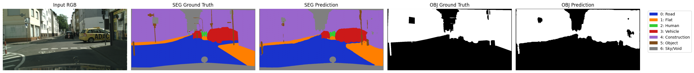
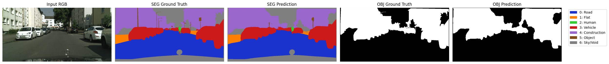
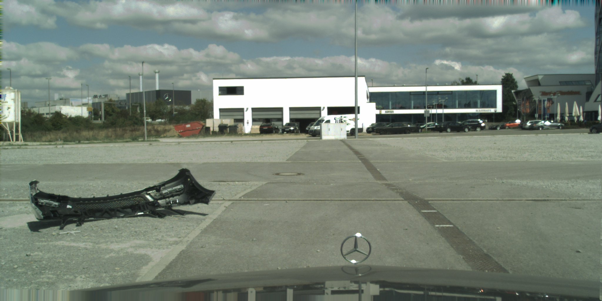
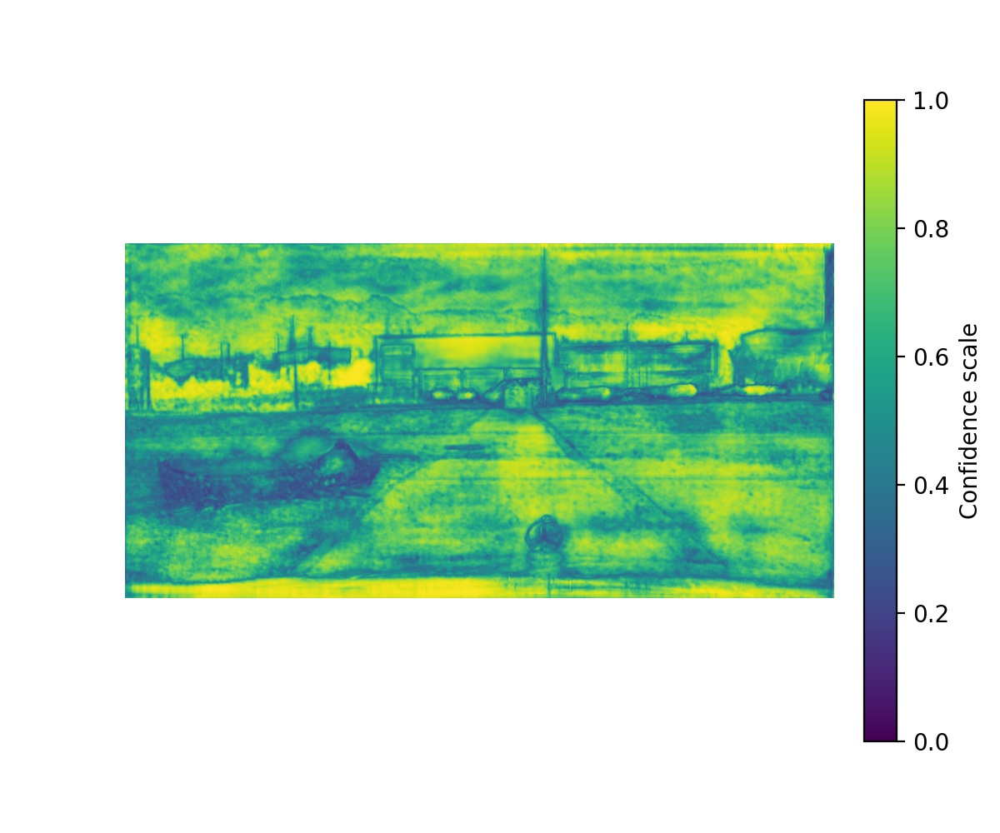
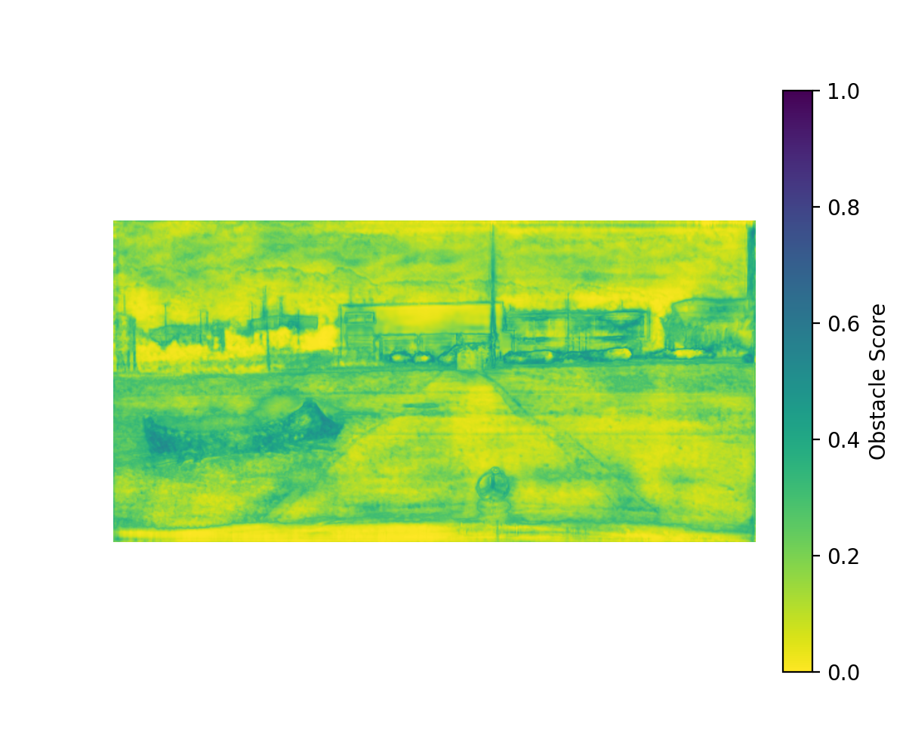
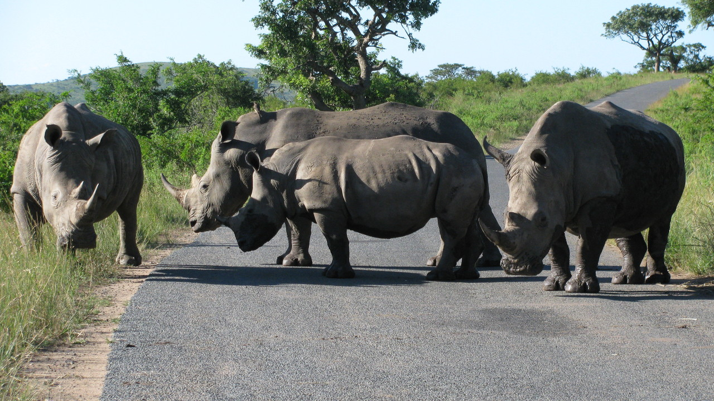
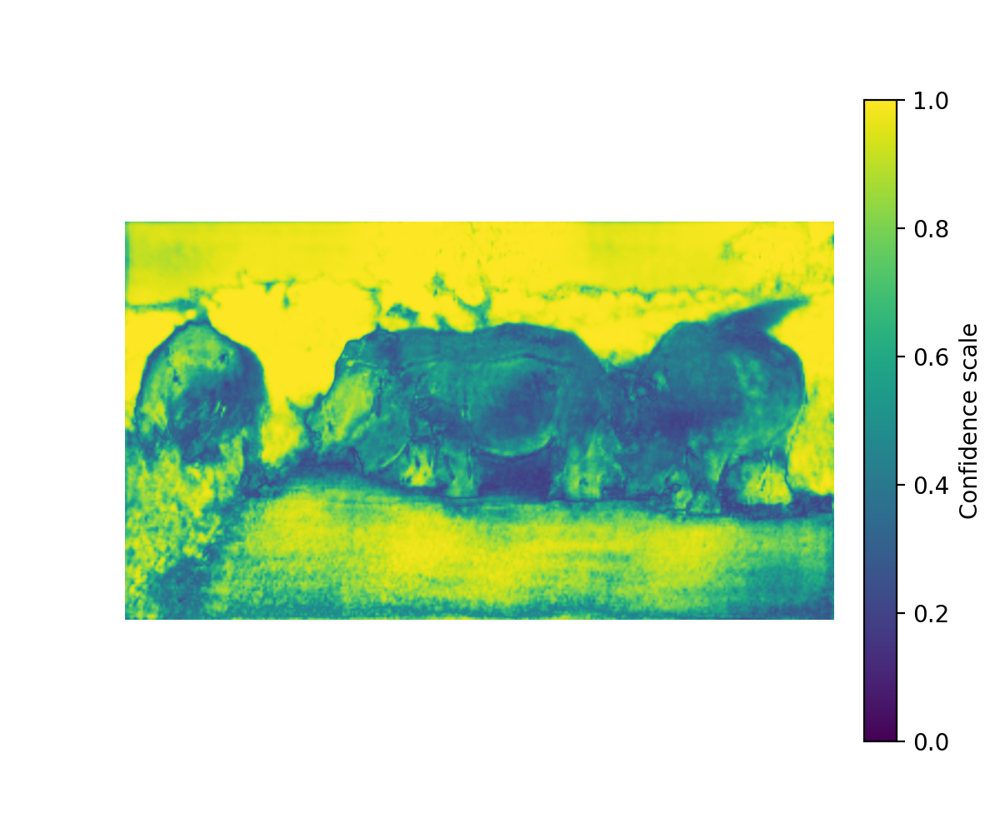
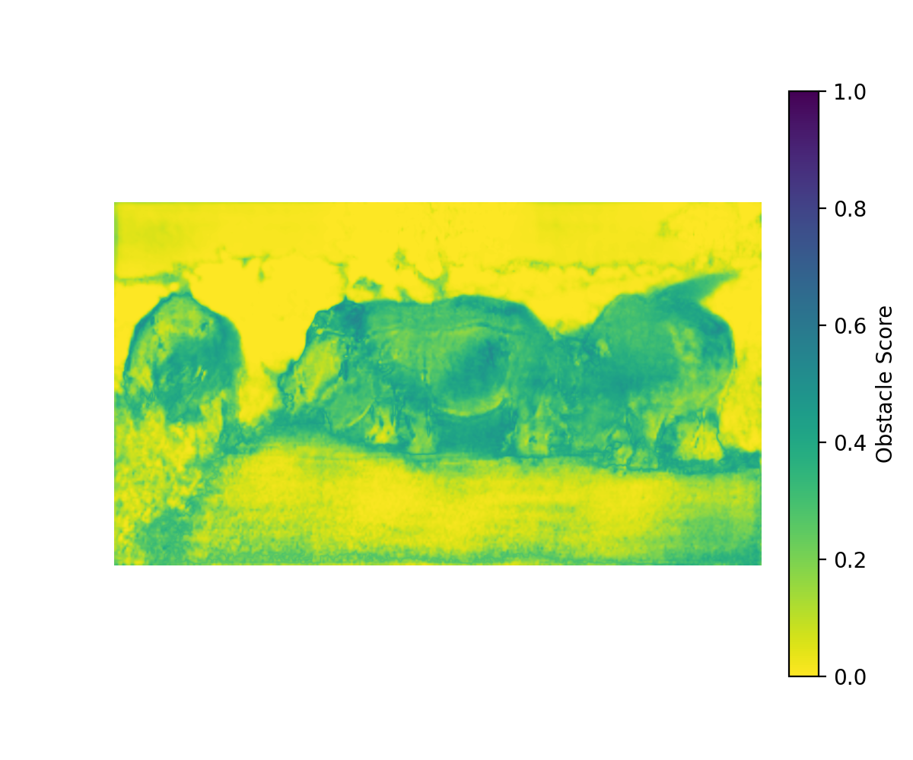

# Uncertainty-Aware Road Obstacle Identification

This project was developed as part of the Computer Vision course, as students belonging to the Master of Science in Artificial Intelligence and Robotics of University of Rome La Sapienza, in the Academic Year 2024-2025

## Project overview

The goal was initially to develop a general, model-agnostic framework for road obstacle identification, applicable to any output of semantic segmentation networks, in order to later leverage uncertainty estimation techniques, to provide formal statistical guarantees about prediction confidence.

## Method overview

Introduction of a dual-head segmentation model, based on DeepLabv3+ architecture:

- Segmentation Head: 7-class softmax over known macro-classes (e.g. road, vehicle, human...)
- Objectness Head: sigmoid output for binary object vs background prediction

The uncertainty is quantified using **Conformal Prediction** on segmentation head's softmax confidence.

## Object definition
The model learned to classify a pixel as object if belonging to one of these classes (after remapping):

- Human 
- Vehicle
- Construction
- Object (please note: name of a predefined class involving poles, pole groups, traffic lights, traffic signs)

## Obstacle definition

Each pixel is classified as obstacle if and only if:

- The objectness probability is above a certain threshold
- The segmentation prediction confidence is *below the conformal threshold*
## Datasets employed

The datasets provided by the teaching organs were the following:

- Cityscapes
- LostAndFound
- Fishyscapes

We aborted using the third one, given there only was a correspondance (with respect to RGB images to be paired with LostAndFound) for the Maurener Weg city, resulting in too few images.
Luckily, the RoadAnomaly dataset (as mentioned in this paper https://doi.org/10.48550/arXiv.1904.07595) came into help, providing a lot of OOD data to perform an inference procedure which was worth talking about.

#### Cityscapes
This dataset has been exploited with training and validation sets for the semantic segmentation model and to perform the conformal calibration of the formerly mentioned threshold value (by taking a subset of 100 unseen samples from the /val folder). A label remapping has been performed, as recommended by the effectivenes of this choice, shown in this paper:
https://doi.org/10.48550/arXiv.2403.18207.
The two *downloadables* chosen were the following:
- RGB images of street scenarios: https://www.cityscapes-dataset.com/file-handling/?packageID=3
- Ground Truth annotations: https://www.cityscapes-dataset.com/file-handling/?packageID=1 

#### LostAndFound
This dataset has been chosen to perform the inference and evaluation procedures about the developed system.
The *downloadables* were the following:

- RGB images of street scenarios (same as Cityscapes, but with obstacles on the road): https://wwwlehre.dhbw-stuttgart.de/~sgehrig/lostAndFoundDataset/leftImg8bit.zip
- Ground Truth annotations: https://wwwlehre.dhbw-stuttgart.de/~sgehrig/lostAndFoundDataset/gtCoarse.zip
Please note that the annotations provided were coarse, and only limited to road and obstacles on it. The inference procedure on this dataset has been adapted accordingly.
Also, 31 images have been excluded since they were corrupted data and couldn't be opened, resulting in metrics damage (until finding out).

#### RoadAnomaly
As formerly mentioned, this dataset took the place of Fishyscapes for inference.
Here is the link: https://datasets-cvlab.epfl.ch/2019-road-anomaly/RoadAnomaly_jpg.zip

## Experimental setup

- Framework: Pytorch
- Training details: 30 epochs, convergence reached after 15
- Loss: double loss combined together, Cross Entropy (segmentation head) + Binary Cross Entropy (sigmoid head)
- Optimizer: SGD with poly LR decay
- Conformal calibration: many attempts made, finally adopted alpha = 0.15. Performerd on 100-image calibration split (retained from Cityscaped validation set)
- Inference threshold: attempts followed the alpha ones, finally adopted 0.46

## Evaluation Metrics

### Segmentation model

- mIoU: 0.6925 after 15 epochs, then plateau'd

### Inference global metrics

##### LostAndFound
31 corrupted samples excluded

| Metric     | Precision | Recall   | F1 Score | IoU      |
| ---------- | --------- | -------- | -------- | -------- |
| **Mean**   | 0.297769  | 0.492834 | 0.317349 | 0.198677 |
| **Std**    | 0.207538  | 0.201873 | 0.149358 | 0.117190 |
| **Min**    | 0.061439  | 0.156852 | 0.106540 | 0.055723 |
| **Max**    | 0.797638  | 0.936249 | 0.752533 | 0.602348 |
| **Median** | 0.223323  | 0.496394 | 0.294525 | 0.172508 |

###### Global score-based metrics

| Metric         | Value    |
| -------------- | -------- |
| **AUROC**      | 0.681241 |
| **FPR\@95TPR** | 0.812987 |

##### RoadAnomaly

| Metric     | Precision | Recall   | F1 Score | IoU      |
| ---------- | --------- | -------- | -------- | -------- |
| **Mean**   | 0.007024  | 0.700488 | 0.013409 | 0.006931 |
| **Std**    | 0.014545  | 0.274468 | 0.025529 | 0.014156 |
| **Min**    | 0.000007  | 0.001259 | 0.000014 | 0.000007 |
| **Max**    | 0.248410  | 1.000000 | 0.385914 | 0.239091 |
| **Median** | 0.002638  | 0.779594 | 0.005259 | 0.002637 |

###### Global score-based metrics

| Metric         | Value    |
| -------------- | -------- |
| **AUROC**      | 0.842127 |
| **FPR\@95TPR** | 0.541097 |

## Visual examples

### A couple of training samples (RGB image, ground truths, prediction of both heads of the model)
**Please note that Objectness ground truth was not provided as it is, but exactly retrieved from ground truth labels (just an additional remapping where the four classes in former section "Object definition" have been binarily remapped)**

### Example of LostAndFound inference results
**Sample: Festplatz Flugfeld**
- RGB

- Confidence Map

- Obstacle Score (softmax head and calibrated unknown objectness score)
**Please note that the obstacle score heatmap behaviour has been reversed in order to make it easier to compare with the confidence map**

### Example of RoadAnomaly inference results
**Sample: Rhino Crossing (RoadAnomaly)**
- RGB

- Confidence Map

- Obstacle Score

